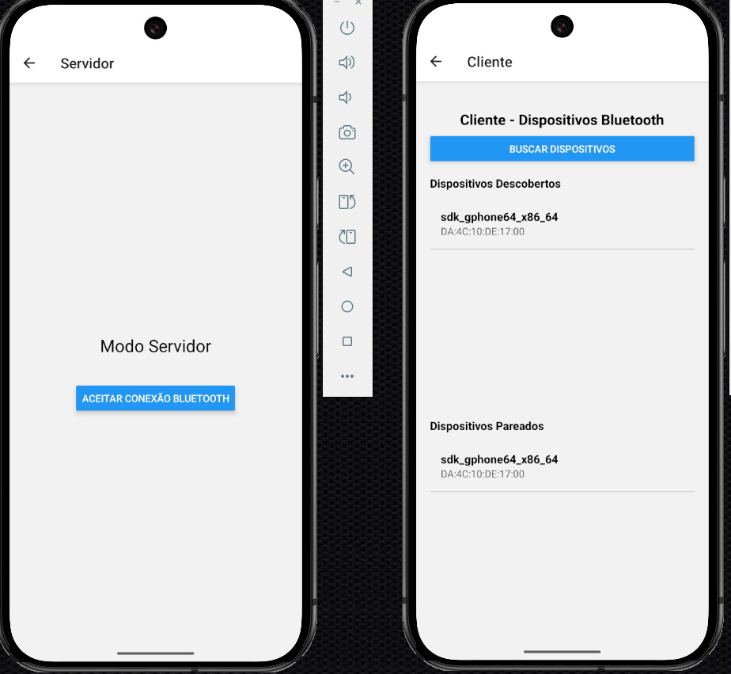
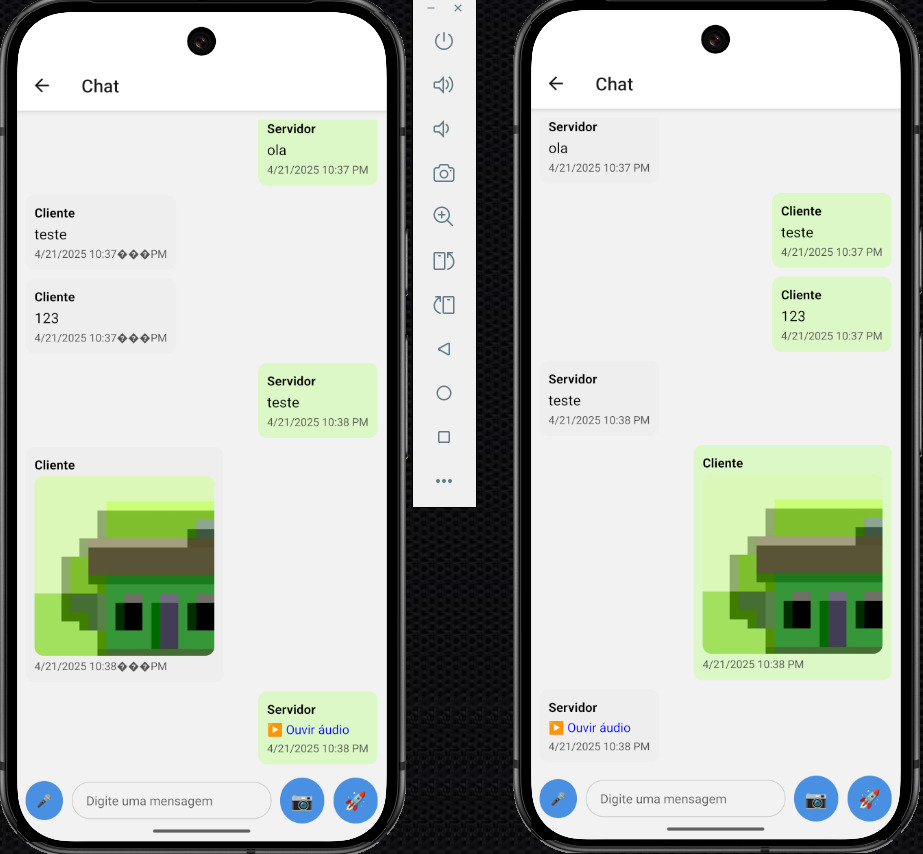

# 📱 Chat Local via Bluetooth com React Native

Este é um aplicativo de chat local desenvolvido com **React Native** (sem Expo), que permite a comunicação via **Bluetooth clássico** entre dois dispositivos Android. Um atua como "servidor", outro como "cliente". É possível enviar mensagens de texto e áudios curtos.

---
## 📱 Telas




## 🚀 Funcionalidades

- Conexão entre dois dispositivos via Bluetooth
- Envio e recebimento de mensagens de texto
- Gravação, envio e reprodução de áudios curtos
- Histórico local das mensagens

---

## 📦 Bibliotecas Utilizadas

| Biblioteca                         | Finalidade                                                                 |
|------------------------------------|---------------------------------------------------------------------------|
| `react-native-bluetooth-classic`   | Comunicação Bluetooth clássica entre os dispositivos                      |
| `react-native-audio-recorder-player` | Gravação e reprodução de áudio no dispositivo                             |
| `react-native-fs`                  | Manipulação de arquivos locais (para salvar os áudios temporariamente)   |
| `@react-navigation/native`         | Navegação entre telas do app                                             |
| `@react-navigation/native-stack`   | Stack de navegação moderna para React Native                             |
| `@react-native-async-storage/async-storage` | Armazenamento local de dados (como histórico de mensagens)               |


---

## ⚙️ Por que **React Native CLI** (sem Expo)?

Utilizei o React Native CLI ao invés do Expo porque:

- O **Expo não tem suporte nativo ao Bluetooth clássico**, o que inviabiliza a comunicação direta entre dispositivos via Bluetooth.
- O acesso a APIs nativas (como Bluetooth, gravação de áudio, manipulação de arquivos) exige **configurações nativas no Android**, possíveis apenas com React Native CLI.

---

## 🛠️ Instalação

### Pré-requisitos

- Node.js LTS
- Android Studio (SDK, emulator ou dispositivo físico)
- Java JDK 17
- React Native CLI

### Passos

```bash
git clone https://github.com/ffelipealves/chat-bluetooth-app.git
cd chat-bluetooth-app
npm install
npx react-native run-android
```
### Demonstração
https://youtu.be/vLdlrEO3feI

